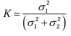
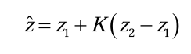

记录学习卡尔曼过程

BV1ez4y1X7eR
BV1Rh41117MT
https://blog.csdn.net/Poulen/article/details/147814529?spm=1001.2014.3001.5506
https://zhuanlan.zhihu.com/p/441182819
#### 卡尔曼滤波
* R. E. Kalman, "A New Approach to Linear Filtering and Prediction Problems," Journal of Basic Engineering, vol. 82, no. 1, pp. 35–45, 1960.
#### 扩展卡尔曼滤波
* A. Gelb (Ed.), "Applied Optimal Estimation," MIT Press, 1974.
#### 误差状态卡尔曼滤波
* M. S. Grewal and R. E. Kalman, "Estimating the state of a solid body in inertial space by error-state Kalman filtering," Proceedings of IEEE Conference on Decision and Control, 1969.

# 卡尔曼滤波器(Kalman Filter / KF)

* 卡尔曼滤波是感知中最广泛应用的算法，常用于多传感器数据融合
* 解算最优的传感器数据，为控制器提供精确可靠的状态量
* 工程中PX4飞控状态量的感知使用ESKF，方便调参使得无人机飞行稳定

---

#### Kalman Filter（卡尔曼滤波器）FK
基础，仅适用于理想的线性系统（GPS+光流）

#### Extended Kalman Filter（扩展卡尔曼滤波器）EKF 
通过线性化处理轻度非线性问题，是应用最广泛的非线性滤波器（GPS+IMU）

#### Error-State Kalman Filter（误差状态卡尔曼滤波器）ESKF 
仅对误差状态滤波，擅长处理包含旋转角等强非线性的状态估计（GPS+IMU）

#### Error-State Iterated Kalman Filter（误差状态迭代卡尔曼滤波器）ESIKF 
在ESKF基础上引入迭代优化，以计算量为代价换取最高的估计精度（slam）

---

## 引言：卡尔曼滤波的思想
平均滤波

\[
\hat{x}_k = \frac{1}{k} \sum_{i=1}^k z_i
\]

### 对上式进行变换

得到

令卡尔曼增益 \( K_k = \frac{1}{k} \)，则公式可写为：
-
\[
\hat{x}_k = \hat{x}_{k-1} + K_k (z_k - \hat{x}_{k-1})
\]
-
其中 \( K_k = \frac{1}{k} \) 称为卡尔曼增益（Kalman Gain）。在这个上下文中，它只是一个权重系数，用于平衡上一次估计值和当前测量值。

### 解释公式
- **当前估计值** \( \hat{x}_k \) 
= **上次估计值** \( \hat{x}_{k-1} \) + **卡尔曼增益** \( K_k \) （ **当前测量值** \( z_k \) - **上次估计值** $\hat{x}_{k-1}$ ）

* 
- **当 \( k \) 较小（例如 \( k=1 \))**：\( K_k = \frac{1}{k} = 1 \)，所以 \( \hat{x}_k = z_k \)。这意味着测量结果起主导作用，估计值完全信任当前测量。
- **当 \( k \) 较大（例如 \( k \to \infty \))**：\( K_k = \frac{1}{k} \to 0 \)，所以 \( \hat{x}_k \approx \hat{x}_{k-1} \)。这意味着测量结果对估计值的影响很小，估计值已经稳定，接近真实值。
---
- **Eg:假设有两个称(方差分别为2g和4g)，称30g物体，结果$z_1= 29g$ , $z_2= 32g$**

---

# GPS测量加速汽车的卡尔曼滤波

## 状态空间模型推导

### 状态向量定义
对于匀加速运动的汽车，我们定义状态向量为：
\[
\mathbf{x} = \begin{bmatrix} p \\ v \end{bmatrix}
\]
其中：
- \( p \)：位置
- \( v \)：速度

### 状态空间方程（过程模型）
根据匀加速运动学方程，并考虑加速度的影响：
- \( p_{k+1} = p_k + v_k \Delta t + \frac{1}{2} a \Delta t^2 \)
- \( v_{k+1} = v_k + a \Delta t \)

由于加速度 \( a \) 不是状态变量，我们将其建模为过程噪声的一部分。状态空间方程为：
\[
\mathbf{x}_{k+1} = F \mathbf{x}_k + G a + \mathbf{w}_k
\]
其中：
- 状态转移矩阵 \( F \) 为：
\[
F = \begin{bmatrix}
1 & \Delta t \\
0 & 1
\end{bmatrix}
\]
- 控制矩阵 \( G \) 为：
\[
G = \begin{bmatrix}
\frac{1}{2} \Delta t^2 \\
\Delta t
\end{bmatrix}
\]
- \( \mathbf{w} \sim N(0, Q) \) 是过程噪声

### 测量方程（观测模型）
假设GPS仅测量位置 \( p \)，则测量方程为：
\[
z_k = H \mathbf{x}_k + v_k
\]
其中：
- \( H = \begin{bmatrix} 1 & 0 \end{bmatrix} \) (观测矩阵)
- \( v \sim N(0, R) \) (测量噪声)

## 卡尔曼滤波公式

*   **Q**: **过程噪声协方差矩阵，汽车路上有颠簸**
*   **R**: **测量噪声协方差矩阵，GPS测量误差**

### 预测步骤（忽略误差）
1. 由状态空间方程推导,忽略误差，状态预测：
   \[
   \hat{\mathbf{x}}^{-}_k = F \hat{\mathbf{x}}_{k-1} + G a
   \]

2. 推导略，用于$K_k$的计算，误差协方差预测：
   \[
   P^{-}_k = F P_{k-1} F^T + Q
   \]

### 更新步骤（$K_k$引入误差）
1. 最小协方差的$K_k$推导略，卡尔曼增益计算：
   \[
   K_k = P^{-}_k H^T (H P^{-}_k H^T + R)^{-1}
   \]

2. 引入测量值$z_k$修正状态，状态更新：
   \[
   \hat{\mathbf{x}}_k = \hat{\mathbf{x}}^{-}_k + K_k (z_k - H \hat{\mathbf{x}}^{-}_k)
   \]
- **当前估计值** \( \hat{x}_k \) 
= **先验估计值** $\hat{\mathbf{x}}^{-}_k$ + **卡尔曼增益** \( K_k \) （ **当前测量值** \( z_k \) - **先验估计值** H$\hat{\mathbf{x}}^{-}_k$ ）
3. 引入测量值$z_k$修正协方差，误差协方差更新：
   \[
   P_k = (I - K_k H) P^{-}_k
   \]

---
# 基于雷达测量的匀速目标EKF跟踪
### EKF针对非线性系统进行线性化

我们有一个雷达传感器，可以测量目标的：
- 径向距离 \( r \)
- 方位角度 \( \theta \)
- 径向速度 \( v_r \)

我们需要在二维直角坐标系下跟踪一个匀速运动的目标。

## 状态空间模型

### 状态向量定义
在直角坐标系下，我们定义状态向量为：
\[
\mathbf{x} = \begin{bmatrix} x \\ y \\ v_x \\ v_y \end{bmatrix}
\]
其中：
- \( x, y \)：目标在直角坐标系下的位置
- \( v_x, v_y \)：目标在直角坐标系下的速度分量

### 过程模型（状态转移）
对于匀速运动的目标，状态转移方程为：
\[
\mathbf{x}_{k+1} = F \mathbf{x}_k + \mathbf{w}_k
\]
其中状态转移矩阵 \( F \) 为：
\[
F = \begin{bmatrix}
1 & 0 & \Delta t & 0 \\
0 & 1 & 0 & \Delta t \\
0 & 0 & 1 & 0 \\
0 & 0 & 0 & 1
\end{bmatrix}
\]
\( \mathbf{w}_k \) 是过程噪声，服从正态分布 \( N(0, Q) \)。

### 测量模型
雷达测量值为：
\[
\mathbf{z}_k = \begin{bmatrix} r \\ \theta \\ v_r \end{bmatrix} = h(\mathbf{x}_k) + \mathbf{v}_k
\]
其中 \( h(\mathbf{x}_k) \) 是将直角坐标系状态转换为极坐标测量的非线性函数：
\[
h(\mathbf{x}_k) = \begin{bmatrix}
\sqrt{x_k^2 + y_k^2} \\
\arctan\left(\frac{y_k}{x_k}\right) \\
\frac{x_k v_{x,k} + y_k v_{y,k}}{\sqrt{x_k^2 + y_k^2}}
\end{bmatrix}
\]
\( \mathbf{v}_k \) 是测量噪声，服从正态分布 \( N(0, R) \)。

## 扩展卡尔曼滤波(EKF)公式

### 预测步骤
1. 状态预测：
   \[
   \hat{\mathbf{x}}^{-}_k = F \hat{\mathbf{x}}_{k-1}
   \]

2. 误差协方差预测：
   \[
   P^{-}_k = F P_{k-1} F^T + Q
   \]

### 更新步骤
1. 计算雅可比矩阵 \( H_k \)：
#### 注意下标k（在 \( \hat{\mathbf{x}}^{-}_k \) 处线性化），说明线性化的观测矩阵$H_k$是不断更新的
   \[
   H_k = \frac{\partial h}{\partial \mathbf{x}} \Big|_{\mathbf{x} = \hat{\mathbf{x}}^{-}_k}
   \]
   
   雅可比矩阵的具体形式为：
   \[
   H_k = \begin{bmatrix}
   \frac{x}{\sqrt{x^2+y^2}} & \frac{y}{\sqrt{x^2+y^2}} & 0 & 0 \\
   -\frac{y}{x^2+y^2} & \frac{x}{x^2+y^2} & 0 & 0 \\
   \frac{v_x r - x v_r}{r^2} & \frac{v_y r - y v_r}{r^2} & \frac{x}{r} & \frac{y}{r}
   \end{bmatrix}
   \]
   其中 \( r = \sqrt{x^2+y^2} \)，\( v_r = \frac{x v_x + y v_y}{r} \)

2. 卡尔曼增益计算：
   \[
   K_k = P^{-}_k H_k^T (H_k P^{-}_k H_k^T + R)^{-1}
   \]

3. 状态更新：
   \[
   \hat{\mathbf{x}}_k = \hat{\mathbf{x}}^{-}_k + K_k (\mathbf{z}_k - h(\hat{\mathbf{x}}^{-}_k))
   \]

4. 误差协方差更新：
   \[
   P_k = (I - K_k H_k) P^{-}_k
   \]

---
## ESKF原理
在现代的大多数IMU系统中，人们往往使用误差状态卡尔曼滤波器（Error state Kalman filter, ESKF）而非原始状态的卡尔曼滤波器。大部分基于滤波器的LIO或VIO实现中，都使用ESKF作为状态估计方法。相比于传统KF，ESKF的优点可以总结如下：

1. 在旋转的处理上，ESKF的状态变量可以采用最小化的参数表达，也就是使用三维变量来表达旋转的增量。而传统KF需要用到四元数（4维）或者更高维的表达（旋转矩阵，9维），要不就得采用带有奇异性的表达方式（欧拉角）。
2. ESKF总是在原点附近，离奇异点较远，并且也不会由于离工作点太远而导致线性化近似不够的问题。
3. ESKF的状态量为小量，其二阶变量相对来说可以忽略。同时大多数雅可比矩阵在小量情况下变得非常简单，甚至可以用单位阵代替。
4. 误差状态的运动学也相比原状态变量要来得更小，因为我们可以把大量更新部分放到原状态变量中。

在ESKF中，我们通常把原状态变量称为名义状态变量（nominal state），然后把ESKF里的状态变量称为误差状态变量（error state）。ESKF整体流程如下：当IMU测量数据到达时，我们把它积分后，放入名义状态变量中。由于这种做法没有考虑噪声，其结果自然会快速漂移，于是我们希望把误差部分作为误差变量，放在ESKF中。ESKF内部会考虑各种噪声和零偏的影响，并且给出误差状态的一个高斯分布描述。同时，ESKF本身作为一种卡尔曼滤波器，也具有预测过程和修正过程，其中修正过程需要依赖IMU以外的传感器观测。当然，在修正之后，ESKF可以给出后验的误差高斯分布，随后我们可以把这部分误差放入名义状态变量中，并把ESKF置零，这样就完成了一次循环。

---

# ESKF 符号化推导（简洁版）

---

## 1. 状态分解

真实状态与名义状态：

$$
x_t = \hat{x} \oplus \delta x
$$

其中

* $x_t$：真实值
* $\hat{x}$：名义状态（nonlinear propagate）
* $\delta x$：误差状态（linear Kalman filter），$\oplus$ 表示“广义加法”运算（比如加法或乘法，取决于状态类型）。

---
## 2. 系统状态方程和观测方程

#### 2.1 名义状态非线性系统方程

$$
\dot{\hat{x}} = f(\hat{x}, u, 0)\tag{1}
$$

#### 2.2 误差状态系统方程（线性化）

误差满足近似线性系统：

$$
\delta\dot{x} = F \, \delta x + G \, w\tag{2}
$$

其中

* $F = \left.\frac{\partial f}{\partial x}\right|_{\hat{x},u}$
* $G = \left.\frac{\partial f}{\partial w}\right|_{\hat{x},u}$
* $w$：过程噪声。

#### 离散化

在采样间隔 $\Delta t$ 上：

$$
\delta x_{k} \approx \Phi \, \delta x_{k-1} + w_{d-1}\tag{3}
$$
其中

* $\Phi = e^{F \Delta t}$
* $Q_d = \int_0^{\Delta t} e^{F\tau} G Q_c G^\top e^{F^\top \tau} d\tau$

#### 2.3 观测方程
是对误差状态的观测而不是测量值的观测，故同理进行分解
包含误差的真实观测方程：

$$
z_t = h(x_t) + v\tag{4}
$$

观测残差（innovation / residual），可以理解为是观测误差方程：

$$
\delta y_k \equiv z_{tk} - \hat{z_k} = z_{tk} - h(\hat{x_k}) \approx H_k \delta x_k + v_k\tag{5}
$$

其中
$H_k = \left.\frac{\partial h}{\partial x_k}\right|_{\hat{x_k}}$

---

## 4. 预测（Predict）

公式(3)进行预测，误差状态先验：

$$
\hat{\delta x}_{k|k-1} = \Phi \hat{\delta x}_{k-1|k-1}\tag{6}
$$

误差状态协方差先验：

$$
P_{k|k-1} = \Phi P_{k-1|k-1} \Phi^\top + Q_d\tag{7}
$$

公式(1)，名义状态先验：

$$
\hat{x}_{k|k-1} = f_d(\hat{x}_{k-1|k-1}, u_k)\tag{8}
$$

---

## 7. 更新（Update）

卡尔曼增益：

$$
K = P H^\top (H P H^\top + R)^{-1}\tag{9}
$$

误差估计：

$$
\hat{\delta x}_{k|k} = K y\tag{10}
$$
可以理解为：误差状态每次都整合进名义状态中了，误差状态归零了
原式 $\hat{\delta x}_{k|k} = \hat{\delta x}_{k|k-1}  + K (y-H \hat{\delta x}_{k|k-1} )$
但是  $\hat{\delta x}_{k|k-1} = 0$

误差状态协方差后验：

$$
P_{k|k} = (I - K H) P_{k|k-1}\tag{11}
$$

---

## 8. 注入与复位（Injection & Reset）

将误差注入回名义状态，名义状态后验：

$$
\hat{x}_{k|k} = \hat{x}_{k|k-1} \oplus \hat{\delta x}_{k|k}\tag{12}
$$

误差状态重置为零：

$$
\hat{\delta x}_{k|k} = 0\tag{13}
$$

协方差变换：

$$
P_{k+1|k} = G_{\text{inj}} P_{k|k} G_{\text{inj}}^\top\tag{14}
$$

其中 $G_{\text{inj}}$ 是复位的雅可比矩阵。

---

